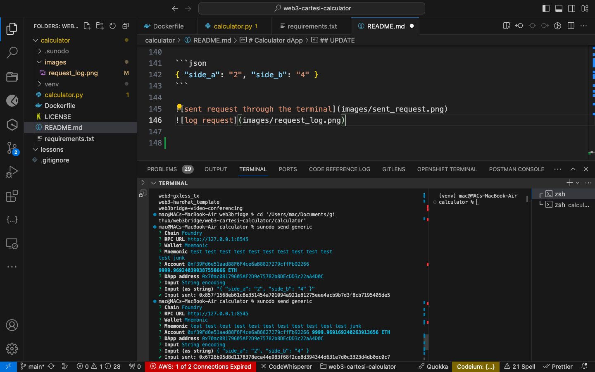
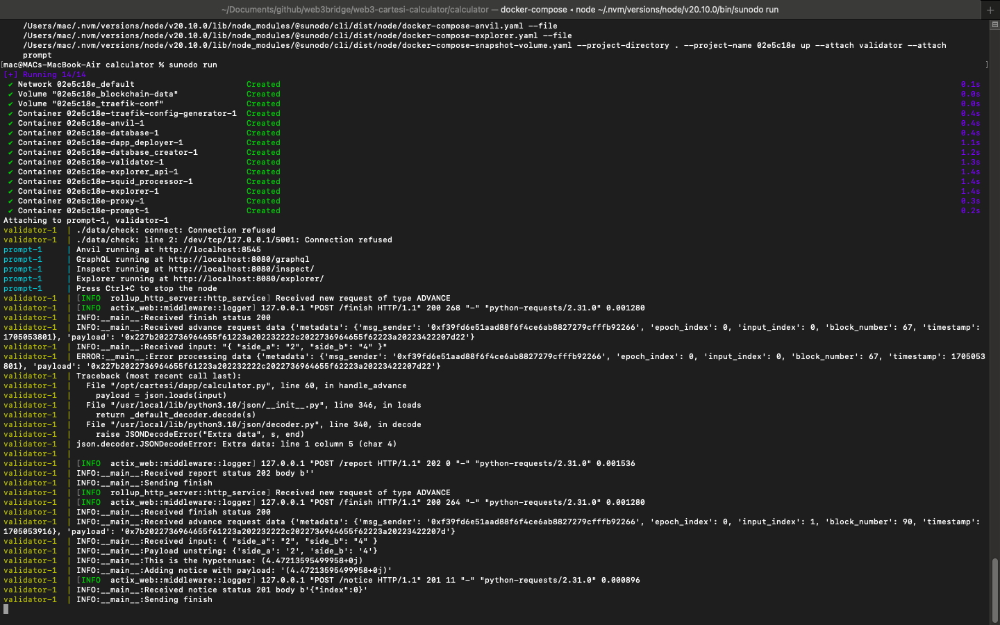

# Calculator dApp

This Calculator dApp is built using [Sunodo](https://docs.sunodo.io/), a Cartesi "Rollups as a Service" platform. Sunodo provides a robust set of tools to streamline the development workflow of Cartesi applications. 

It is written in Python and uses the [Python Mathematical Expression Evaluator](https://pypi.org/project/py-expression-eval/) library for arithmetic calculations. The dApp processes arithmetic expressions encoded in hex format and returns the results as a notice in a similar format.

## Requirements and Installation

The Sunodo CLI heavily uses Docker under the hood, so you must have it installed and up-to-date.

The recommended way to have all plugins ready for building is to install [Docker Desktop](https://www.docker.com/products/docker-desktop/).

### macOS

If you have [Homebrew](https://brew.sh/) installed, you can install Sunodo by running this command:

```bash
brew install sunodo/tap/sunodo
```

Alternatively, you can install Sunodo with Node.js by running:

```bash
npm install -g @sunodo/cli
```

### Linux

You can either use [Homebrew on Linux](https://docs.brew.sh/Homebrew-on-Linux), or install Sunodo with:

```
npm install -g @sunodo/cli
```

### Windows

Install [WSL2](https://learn.microsoft.com/en-us/windows/wsl/install) and the Ubuntu dsitro from Microsoft Store and install Sunodo with:

```
npm install -g @sunodo/cli
```


## Building the application

To build the application, run:

```
sunodo build
```

You should see a Cartesi Machine snapshot output similar to this:

```
         .
        / \
      /    \
\---/---\  /----\
 \       X       \
  \----/  \---/---\
       \    / CARTESI
        \ /   MACHINE
         '

[INFO  rollup_http_server] starting http dispatcher service...
[INFO  rollup_http_server::http_service] starting http dispatcher http service!
[INFO  actix_server::builder] starting 1 workers
[INFO  actix_server::server] Actix runtime found; starting in Actix runtime
[INFO  rollup_http_server::dapp_process] starting dapp: python3 calculator.py
INFO:__main__:HTTP rollup_server url is http://127.0.0.1:5004
INFO:__main__:Sending finish

Manual yield rx-accepted (0x100000000 data)
Cycles: 2801607569
2801607569: 949fc4c3fc34333a0add4c1f367d2cc1d8c802c3ab3e5b96a78a116b78070dba
Storing machine: please wait
```

## Running the application

This executes a Cartesi node for the application previously built with `sunodo build`.

```
sunodo run
```

It should print this output:

```
 ✔ Network 949fc4c3_default                       Created                                                                                                                                              0.0s
 ✔ Volume "949fc4c3_blockchain-data"              Created                                                                                                                                              0.0s
 ✔ Volume "949fc4c3_traefik-conf"                 Created
949fc4c3-prompt-1     | Anvil running at http://localhost:8545
949fc4c3-prompt-1     | GraphQL running at http://localhost:8080/graphql
949fc4c3-prompt-1     | Inspect running at http://localhost:8080/inspect/
949fc4c3-prompt-1     | Explorer running at http://localhost:8080/explorer/
949fc4c3-prompt-1     | Press Ctrl+C to stop the node
```

## Interacting with the application

You can use the `sunodo send` command to send input payloads to your applications.

With your node running, open a new terminal tab. You can send a generic input to your application as follows:

```shell
 sunodo send generic
```

For local testing, select `Foundry` which gives you mock and test faucets to submit transactions:

```
> sunodo send generic
? Chain (Use arrow keys)
❯ Foundry
? Chain Foundry
? RPC URL http://127.0.0.1:8545
? Wallet Mnemonic
? Mnemonic test test test test test test test test test test test junk
? Account 0xf39Fd6e51aad88F6F4ce6aB8827279cffFb92266 9999.969170031383970357 ETH
? DApp address 0x70ac08179605AF2D9e75782b8DEcDD3c22aA4D0C
? Input String encoding
? Input (as string) 3 + 5 * 10  
✔ Input sent: 0xd30150ee888a2bbf6b491812ee9ca28cb5754381eba3415ce4087322768c191f
```

It will evaluate the mathematical expression `3 + 5 * 10` and add the outcome `53` as a notice:

```
43272d70-validator-1  | INFO:__main__:Received finish status 200
43272d70-validator-1  | INFO:__main__:Received advance request data {'metadata': {'msg_sender': '0xf39fd6e51aad88f6f4ce6ab8827279cfffb92266', 'epoch_index': 0, 'input_index': 0, 'block_number': 9, 'timestamp': 1701764544}, 'payload': '0x332b352a3130'}
43272d70-validator-1  | INFO:__main__:Received input: 3+5*10
43272d70-validator-1  | INFO:__main__:Adding notice with payload: '53'
```

## UPDATE
I upgraded the calculator to calculate pythagoras theorem.

You can pass the following json string:

```json
{ "side_a": "2", "side_b": "4" }
```



